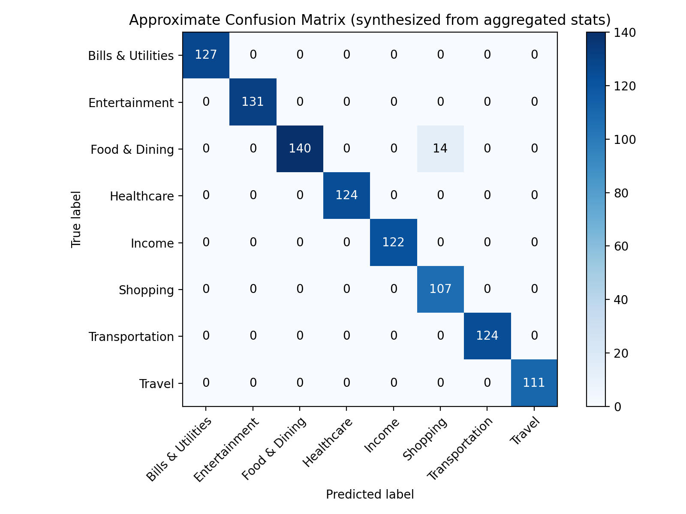

# Metrics Report

Generated by `scripts/generate_metrics_report.py`

## Run details
- **eval_file**: evaluation_results.json
- **samples**: 1000

## Summary

- **Macro F1:** 0.9864
- **Total samples:** 1000

## Per-class metrics

| Label | Precision | Recall | F1 | Support |
|---|---:|---:|---:|---:|
| Bills & Utilities | 1.000 | 1.000 | 1.000 | 127 |
| Entertainment | 1.000 | 1.000 | 1.000 | 131 |
| Food & Dining | 1.000 | 0.909 | 0.952 | 154 |
| Healthcare | 1.000 | 1.000 | 1.000 | 124 |
| Income | 1.000 | 1.000 | 1.000 | 122 |
| Shopping | 0.884 | 1.000 | 0.939 | 107 |
| Transportation | 1.000 | 1.000 | 1.000 | 124 |
| Travel | 1.000 | 1.000 | 1.000 | 111 |

## Confusion Matrix

## Notes & Recommendations

- Focus on classes with low recall to improve coverage.
- Consider more negative sampling during training if many false positives exist for a class.
- Calibrate the reranker probabilities (Platt scaling or isotonic) if confidence is poorly calibrated.
